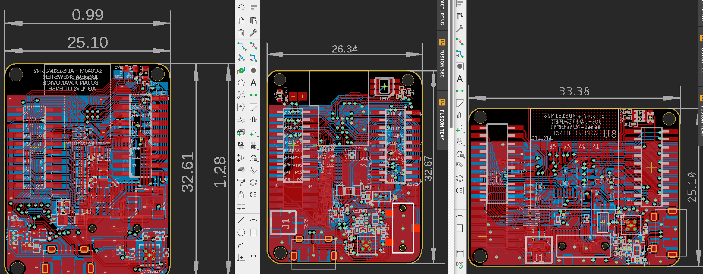
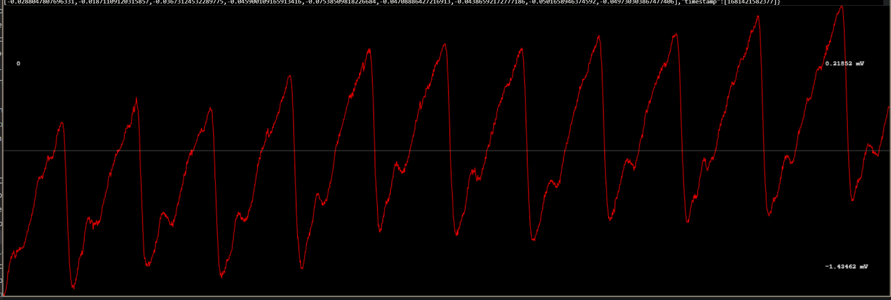

# nRF52/53 Biosensing Boards

This contains our working prototypes for using nRF52 and nRF53 microcontrollers (ARM + BLE5) with low cost sensors. [Doc](https://docs.google.com/document/d/1gOrWiBDynYziCYDMF4r1Rw85PXo9JbuBrYJEEkW2U-c/edit?usp=sharing). 

License: AGPL v3.0 copyleft (public domain). You may do whatever you want with our designs, but you are obligated to share your modifications and advancements publicly. This is in hopes of facilitating a better community around useful wearable medical hardware designs.

The current prototypes here are working breakout boards. They are pin compatible with several different modules while it's easy to spin up new designs with similar products by Fanstel.

Features Zephyr RTOS test firmware, which is hardware-agnostic. 

### Designs included

- BT40/BT840, pin compatible with any Fanstel BT-series but mind the pinouts as not all will work without modification, but most should.
- BC840M
- BC40M
- BT832A (do not use, this was our first attempt)

### Firmware included

- nRF5340
- nRF52840
- nRF52810 (for the BT832A prototype)

### Sensor Support 
- ADS131M08 (8 channel sigma delta converter), there is one on-board 
- MPU6050 accelerometer
- QMC5883L magnetometer (for 9-axis movement when combined with MPU6050)
- MAX30102 pulse oximeter, 
- BMP/BME280 environmental sensor, 
- Additional 8 channel ADS131M08 for up to 16 raw data channels, each individually configurable. 
- MAX98357A Audio output amplifier
- B079Q8G7N1 PDM MEMS microphone

### [Driver Docs](https://docs.google.com/document/d/1eThhvpdm9zZMaKTB0dwuHXi1aBz_5ESBecHRZPxs0kE/edit?usp=sharing)

You can fairly easily add more sensor modules, which are all plug-and-play so the board can run with any combination of sensors. We'll clean this up more as we go for easier customization and feature inclusions. The BT840/BT40, BC840M, and BC40M prototypes include battery chargers with TVS diodes for safety so the boards could be FDA-approved.

Version 3 (BT40/BT840, BC840M R2 & BC40M R1 designs) by Joshua Brewster and Bojan Jovanovich. Firmware by Bojan Jovanovich, drawings and frontend software by Josh Brewster. 

- Incoming minified BC840M revision for the [Open Source Smart Glasses](https://github.com/TeamOpenSmartGlasses/OpenSourceSmartGlasses) project 

Versions 2 (BC840M R1) by Joshua Brewster, Jacob Tinkhauser, Bojan Jovanovich. Firmware by Bojan, drawings and frontend software by Josh Brewster. Testing and early design phase included Jacob Tinkhauser. 

Version 0 (BT832A) by Joshua Brewster, Jacob Tinkhauser, and Bojan Jovanovich. Firmware by Bojan and Jacob, drawings and frontend by Joshua Brewster.

Developed for creating open source [Brains@Play](https://brainsatplay.com) and [MyAlyce (WIP)](https://github.com/myalyce/myalyce) wearables for biofeedback and treatment recovery monitoring.

Related:
- [BLE & USB Web drivers and debugger](https://github.com/joshbrew/device_debugger)

Below results with the ADS131M08 doing quick tests. Noise floor was around 350 nanovolts when shorted. These are not final results but show lots of promise.

- EEG alpha waves (spikes are blinks through a digital bandpass filter)

- ECG with additional digital 50Hz lowpass

- Raw EOG

- Raw PPG wave (red LED + Photodiode BPW 34 w/ basic 1MOhm + 200pf lowpass filter)

Note the ADS131M08 is pretty much completely useless on USB power as we do not have digital or power isolators. We recommend sticking with the Bluetooth 5 and battery support except for when debugging.

Todos:
- PDFs, but the free EAGLE version works for these simple boards.
- Make the firmware more API-like for adding sensors and easier to cross-compile.
- Upgrade zephyr firmware version to latest Nordic SDK version, need to redo dependencies.
- Finish NFC integration
- Fine tune data throttling

Bug fixing notes:
- Bojan note (old, worked elsewhere): Sensors not booting, build error with the audio settings

Exploratory:
- SD card
- Integration with a graphical device (stay tuned :-))
- Vibration motor integration (just a GPIO on/off)
- Frontend controls for the whole command interface in javascript
- GPS (e.g. LG77L)
- More design modularity, e.g. attachments and hubs
