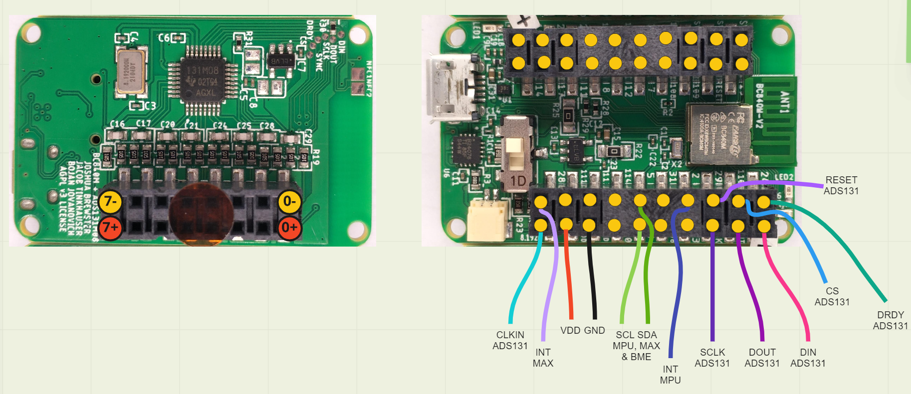
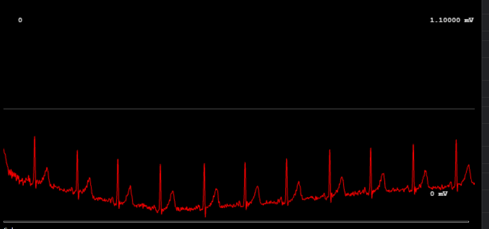
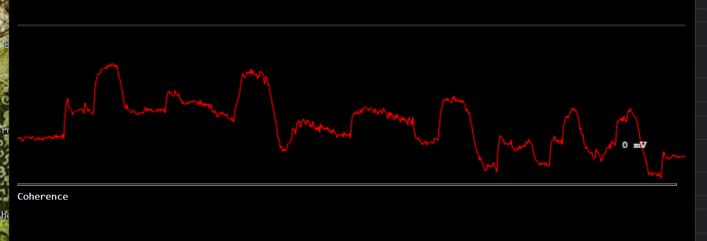

# nRF52 Biosensing Boards

This contains our working prototypes for using nRF52 microcontrollers (ARM + BLE5) with low cost sensors. [Doc](https://docs.google.com/document/d/1gOrWiBDynYziCYDMF4r1Rw85PXo9JbuBrYJEEkW2U-c/edit?usp=sharing). 

License: AGPL v3.0 copyleft (public domain). You may do whatever you want with our designs, but you are obligated to share your modifications and advancements publicly. This is in hopes of creating a better community model around useful hardware designs.

Features Zephyr RTOS test firmware, which is hardware-agnostic. BC840M config is in the Firmware folder incl ADS131 drivers.

The current prototypes here are working breakout boards. They are pin compatible with several different modules while it's easy to spin up new designs with similar products. Next versions will be further miniaturized.

### Sensor Support 
- ADS131M08 (8 channel sigma delta converter), there is one on-board 
- MPU6050 accelerometer 
- MAX30102 pulse oximeter, 
- BMP/BME280 environmental sensor, 
- Additional 8 channel ADS131M08 for up to 16 raw data channels, each individually configurable. 

You can fairly easily add more sensor modules, which are all plug-and-play so the board can run with any combination of sensors. We'll clean this up more as we go for easier customization and feature inclusions. The BT840/BT40, BC840M, and BC40M prototypes include battery chargers with TVS diodes for safety so the boards could be FDA-approved.

Version 3 (BT40/BT840, BC840M R2 & BC40M R1 designs and PDF) by Joshua Brewster and Bojan Jovanovich. Firmware by Bojan Jovanovich, drawings and frontend software by Josh Brewster. Incoming minified BC840M revision for the [Open Source Smart Glasses](https://github.com/TeamOpenSmartGlasses/OpenSourceSmartGlasses) project 

Versions 1 (BT832A) and 2 (BC840M R1) by Joshua Brewster, Jacob Tinkhauser, Bojan Jovanovich. Firmware by Bojan, drawings and frontend software by Josh Brewster. Testing and early design phase included Jacob Tinkhauser. 

Version 0 (BT832A) by Joshua Brewster, Jacob Tinkhauser, and Bojan Jovanovich. Firmware by Bojan and Jacob, drawings and frontend by Joshua Brewster

Developed for creating open source [Brains@Play](https://brainsatplay.com) and [MyAlyce (WIP)](https://github.com/myalyce/myalyce) wearables for biofeedback and treatment recovery monitoring.

Related:
- [BLE & USB Web drivers and debugger](https://github.com/joshbrew/device_debugger)

Below results with the ADS131M08 doing quick tests. Noise floor was around 350 nanovolts when shorted.

- EEG alpha waves (spikes are blinks through a digital bandpass filter)

- ECG with additional digital 50Hz lowpass

- Raw EOG

- Raw PPG wave

Note the ADS131M08 is pretty much completely useless on USB power as we do not have digital or power isolators. We recommend sticking with the Bluetooth 5 and battery support except for when debugging.